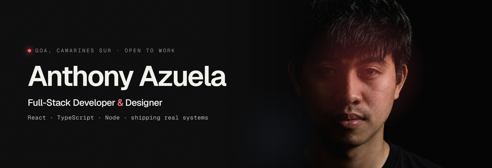

<!--
  GitHub profile README for github.com/azyy00
  Lives in a repo named exactly  azyy00/azyy00  to show on your profile.
  Requires banner.png (in this folder) committed to the repo root.
-->

  
  &nbsp;
  
  
  

---

### About

Full-stack developer and graphic designer from **Goa, Camarines Sur**. I build software for the people around me — most of it runs in production at a community college.

- 🎓 **BS Computer Science**, Partido State University (2025)
- 🛠️ React / TypeScript on the front, Node & Postgres behind it
- 🏆 **DataCamp Scholar** — 9 statements across Python, SQL, data & machine learning
- 🌱 Currently shipping real systems for Goa Community College and local businesses

 

### Tech stack

  

 

### Featured projects

| Project | What it is | Links |
| --- | --- | --- |
| **GCC Library System** | Real-time library attendance, analytics & OPAC — took the college from paper to paperless | [Live](https://gcc-library-frontend.vercel.app) · [Code](https://github.com/azyy00/2026-Library-App) |
| **AQuiz** | Real-time, Kahoot-style quiz game with a live leaderboard and AI-written questions | [Live](https://azyquiz.vercel.app) · [Code](https://github.com/azyy00/quiz-app) |
| **GCC Scheduling** | Conflict-free class timetabling for admins, faculty and students | [Live](https://gcc-scheduling-app.vercel.app) · [Code](https://github.com/azyy00/2026-scheduling-app) |
| **Adelpha's Burger & Cafe** | Single-page site for a homegrown Goa cafe, motion throughout | [Code](https://github.com/azyy00/Restaurant1) |

 

### Activity

  

 

Let's build something worth shipping. — <a href="mailto:anthony.azuela.buenaflor@gmail.com">anthony.azuela.buenaflor@gmail.com</a>

